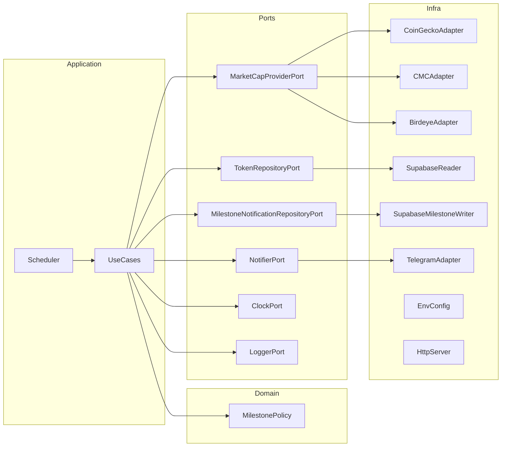

# `TECH_SPEC.md` — FOMObot (Hexagonal Architecture, Read-Only)

## 1) Architecture

Hexagonal (ports & adapters) design isolating domain logic from infrastructure.

### Layers

| Layer           | Responsibility                                                             |
| --------------- | -------------------------------------------------------------------------- |
| **Domain**      | Pure milestone evaluation logic                                            |
| **Application** | Orchestrates polling / comparison / notifications                          |
| **Ports**       | Abstract I/O (providers, repo, notifier, clock, logger)                    |
| **Adapters**    | Concrete integrations (HTTP provider, Supabase reader, Telegram API, etc.) |

### Diagram



---

## 2) Domain Model

```ts
type TokenId = string;
type USD = number;
type Multiple = number;
type Group = 'fsm' | 'issam';

interface Token {
  id: bigint;
  tokenAddress: TokenId;
  symbol: string;
  initialMarketCapUsd: USD;
  firstCalledAtUtc: Date;
}

interface MilestoneConfig {
  id: bigint;
  groupName: Group;
  milestoneValue: Multiple;
  milestoneLabel: string;
  isActive: boolean;
  createdAtUtc: Date;
  updatedAtUtc: Date;
  createdBy?: string;
  notes?: string;
}

interface MilestoneNotification {
  id?: bigint;
  tokenId: bigint;
  tokenAddress: string;
  groupName: Group;
  milestoneValue: Multiple;
  milestoneLabel: string;
  notifiedAtUtc: Date;
  messageId?: string;
}

interface MilestonePolicy {
  milestones: Multiple[];
  crossed(initialCap: USD, currentCap: USD): Multiple[];
}
```

Logic:
`ratio = currentCap / initialCap`
Return all milestones m where `ratio >= m`.

---

## 3) Application Layer

### `RunPollingCycleUseCase`

**Steps**

1. For each group/table (`fsm`, `issam`):

   * `tokens = TokenRepositoryPort.listAll(group)`
   * `activeMilestones = MilestoneConfigRepositoryPort.getActiveMilestones(group)`
   * `caps = MarketCapProviderPort.getCaps(tokens)`
2. For each token with `currentCap`:

   * `crossed = MilestonePolicy.crossed(initial, current, activeMilestones)`
   * For each `milestone` in `crossed`:
     * `alreadyNotified = MilestoneNotificationRepositoryPort.wasNotified(token.id, milestone.value)`
     * If not already notified:
       * `NotifierPort.send(group, buildMessage(token, milestone, current))`
       * `MilestoneNotificationRepositoryPort.recordNotification(token, milestone, group, messageId)`
3. Skip tokens with null caps; log warnings.
4. Maintain in-memory stats (`processed`, `alertsSent`, `skipped`, `errors`).

**Persistence Layer**
- Reads token data from `tokens_fsm`/`tokens_issam` (read-only)
- Reads milestone configuration from `milestones_config` (read-only)
- Writes milestone notifications to `milestone_notifications` (write-only for notifications)

### `GetHealthStatusUseCase`

Returns uptime, last-cycle timestamp, provider name.

---

## 4) Ports

```ts
export interface MarketCapProviderPort {
  getCaps(input: { chain:'solana', addresses:string[] })
    : Promise<Record<string, USD | null>>;
}

export interface TokenRepositoryPort {
  listAll(group: 'fsm' | 'issam'): Promise<Token[]>;
  // read-only – no update methods
}

export interface MilestoneConfigRepositoryPort {
  getActiveMilestones(group: 'fsm' | 'issam'): Promise<MilestoneConfig[]>;
  getMilestoneConfig(id: bigint): Promise<MilestoneConfig | null>;
  createMilestoneConfig(config: Omit<MilestoneConfig, 'id' | 'createdAtUtc' | 'updatedAtUtc'>): Promise<MilestoneConfig>;
  updateMilestoneConfig(id: bigint, updates: Partial<MilestoneConfig>): Promise<MilestoneConfig>;
  deactivateMilestoneConfig(id: bigint): Promise<void>;
}

export interface MilestoneNotificationRepositoryPort {
  wasNotified(tokenId: bigint, milestoneValue: number): Promise<boolean>;
  recordNotification(
    token: Token, 
    milestone: MilestoneConfig, 
    group: 'fsm' | 'issam', 
    messageId?: string
  ): Promise<void>;
  getNotificationsForToken(tokenId: bigint): Promise<MilestoneNotification[]>;
}

export interface NotifierPort {
  send(group:'fsm'|'issam', message:string):Promise<void>;
}

export interface ClockPort { now(): Date; }
export interface LoggerPort {
  info(evt:string, data?:object):void;
  warn(evt:string, data?:object):void;
  error(evt:string, data?:object):void;
}
```

---

## 5) Adapters

### Market-cap Providers

* **CoinGeckoAdapter** – REST API; maps token → coin ID; may return null for new SOL tokens.
* **CMCAdapter** – key-based; better quotas.
* **BirdeyeAdapter** – SOL-native, fast.
  All return `{ [address]: marketCapUsd | null }`.

### Supabase Reader (Read-Only)

```ts
export class SupabaseReader implements TokenRepositoryPort {
  async listAll(group:'fsm'|'issam'):Promise<Token[]> {
    const table = group === 'fsm' ? 'tokens_fsm' : 'tokens_issam';
    const { data } = await supabase.from(table).select('*');
    return data.map(mapToDomainToken);
  }
}
```

### Supabase Milestone Config Reader (Read-Only)

```ts
export class SupabaseMilestoneConfigReader implements MilestoneConfigRepositoryPort {
  async getActiveMilestones(group: 'fsm' | 'issam'): Promise<MilestoneConfig[]> {
    const { data } = await supabase
      .from('milestones_config')
      .select('*')
      .eq('group_name', group)
      .eq('is_active', true)
      .order('milestone_value', { ascending: true });
    
    return data.map(mapToDomainMilestoneConfig);
  }

  async getMilestoneConfig(id: bigint): Promise<MilestoneConfig | null> {
    const { data } = await supabase
      .from('milestones_config')
      .select('*')
      .eq('id', id.toString())
      .single();
    
    return data ? mapToDomainMilestoneConfig(data) : null;
  }

  // Admin methods for milestone management
  async createMilestoneConfig(config: Omit<MilestoneConfig, 'id' | 'createdAtUtc' | 'updatedAtUtc'>): Promise<MilestoneConfig> {
    const { data } = await supabase
      .from('milestones_config')
      .insert({
        group_name: config.groupName,
        milestone_value: config.milestoneValue,
        milestone_label: config.milestoneLabel,
        is_active: config.isActive,
        created_by: config.createdBy,
        notes: config.notes
      })
      .select()
      .single();
    
    return mapToDomainMilestoneConfig(data);
  }

  async updateMilestoneConfig(id: bigint, updates: Partial<MilestoneConfig>): Promise<MilestoneConfig> {
    const { data } = await supabase
      .from('milestones_config')
      .update({
        milestone_value: updates.milestoneValue,
        milestone_label: updates.milestoneLabel,
        is_active: updates.isActive,
        notes: updates.notes,
        updated_at_utc: new Date().toISOString()
      })
      .eq('id', id.toString())
      .select()
      .single();
    
    return mapToDomainMilestoneConfig(data);
  }

  async deactivateMilestoneConfig(id: bigint): Promise<void> {
    await supabase
      .from('milestones_config')
      .update({ is_active: false, updated_at_utc: new Date().toISOString() })
      .eq('id', id.toString());
  }
}
```

### Supabase Milestone Writer (Read-Write)

```ts
export class SupabaseMilestoneWriter implements MilestoneNotificationRepositoryPort {
  async wasNotified(tokenId: bigint, milestoneValue: number): Promise<boolean> {
    const { data } = await supabase
      .from('milestone_notifications')
      .select('id')
      .eq('token_id', tokenId.toString())
      .eq('milestone_value', milestoneValue)
      .limit(1);
    
    return data && data.length > 0;
  }

  async recordNotification(
    token: Token, 
    milestone: MilestoneConfig, 
    group: 'fsm' | 'issam', 
    messageId?: string
  ): Promise<void> {
    await supabase.from('milestone_notifications').insert({
      token_id: token.id.toString(),
      token_address: token.tokenAddress,
      group_name: group,
      milestone_value: milestone.milestoneValue,
      milestone_label: milestone.milestoneLabel,
      message_id: messageId
    });
  }

  async getNotificationsForToken(tokenId: bigint): Promise<MilestoneNotification[]> {
    const { data } = await supabase
      .from('milestone_notifications')
      .select('*')
      .eq('token_id', tokenId.toString())
      .order('notified_at_utc', { ascending: false });
    
    return data.map(mapToDomainNotification);
  }
}
```

### Telegram Adapter

Sends Markdown messages to group chat IDs; retries ×3 on 429/5xx; logs failures.

### Config Adapter

Parses and validates ENV (e.g., zod).

---

## 6) NestJS Module Layout

```
/src
  /domain
    milestone-policy.ts
    types.ts
  /application
    run-polling-cycle.usecase.ts
    get-health.usecase.ts
  /ports
    *.port.ts
  /adapters
    /providers/ (coingecko|cmc|birdeye).adapter.ts
    /persistence/
      supabase-reader.ts
      supabase-milestone-config-reader.ts
      supabase-milestone-writer.ts
    /notifier/telegram.adapter.ts
    /system/env.config.ts
  /interface
    http.controller.ts
    scheduler.service.ts
  app.module.ts
```

---

## 7) Message Template

```ts
function buildMessage(t:Token, milestone:MilestoneConfig, cap:USD):string {
  return [
    `🚨 *${t.symbol}* hit *${milestone.milestoneLabel}* market cap since call-out!`,
    `Initial MC: $${formatUSD(t.initialMarketCapUsd)}`,
    `Current MC: $${formatUSD(cap)}`,
    `Called: ${t.firstCalledAtUtc.toISOString()}`,
    `⏫ Still moving — watch closely.`,
  ].join('\n');
}
```

---

## 8) Scheduler & Performance

* Nest `@Interval(POLL_INTERVAL_SECONDS * 1000)`.
* Batch tokens (N ≈ 100) → parallel requests (concurrency = 5).
* Monitor cycle duration vs interval.

---

## 9) Error Handling

| Type     | Strategy                                             |
| -------- | ---------------------------------------------------- |
| Provider | Retry 3× w/backoff → log → skip                      |
| Telegram | Retry 3× → log → continue                            |
| DB read  | Single retry → if fails, skip whole group this cycle |

---

## 10) ENV Schema

See PRD §9 — identical.

---

## 11) Health & Stats Endpoints

* `/health` → status, provider, lastCycleAt
* `/stats` → cycle metrics (resets each run)

---

## 12) GitHub Actions

Jobs: `lint → test → build → deploy`.
Deploy via Railway CLI/API token on push to `main`.

---

## 13) Testing

* Unit: MilestonePolicy, message builder.
* Integration: mocked providers + Telegram.
* E2E: staging config with test chat IDs and smaller thresholds.

---

## 14) Constraints & Risks

* **Selective Supabase writes:** Only milestone notifications are persisted; token data remains read-only.
* **Dynamic milestone configuration:** Milestones loaded from database at runtime; changes require service restart or cache refresh.
* **Coverage gaps:** CoinGecko/CMC may miss new tokens → Birdeye adapter ready.
* **Rate limits:** mitigated via batching + configurable interval.
* **Cycle lag:** monitor and scale horizontally if avg cycle > interval.
* **Notification deduplication:** Unique constraint on (token_id, milestone_value) prevents duplicate alerts.
* **Data consistency:** Milestone notifications are recorded atomically with Telegram sends.
* **Milestone management:** Admin interface needed for milestone configuration changes.

---

